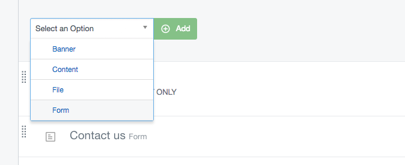

# SilverStripe Elemental UserForms

[](https://travis-ci.org/dnadesign/silverstripe-elemental-userforms)
[](https://scrutinizer-ci.com/g/dnadesign/silverstripe-elemental-userforms/?branch=master)
[](https://codecov.io/gh/dnadesign/silverstripe-elemental-userforms)
[](https://packagist.org/packages/dnadesign/silverstripe-elemental-userforms)
[](LICENSE.md)

## Introduction

This module integrates [silverstripe/silverstripe-userforms](https://github.com/silverstripe/silverstripe-userforms)
into [dnadesign/silverstripe-elemental](https://github.com/dnadesign/silverstripe-elemental) and provides a new
content block called "Form", which can be used to create user defined forms.

## Requirements

* SilverStripe ^4.0
* Elemental ^4.0
* UserForms ^5.0

## Installation

Install with Composer:

```
composer require dnadesign/silverstripe-elemental-userforms 3.x-dev
```

Ensure you run `dev/build?flush=1` to build your database and flush your cache.

## Usage

Once installed, you will see a "Form" option when adding a new element to a page:



From here, editing the form is the same as using the UserForms module normally. Please refer to the
[UserForms module documentation](https://github.com/silverstripe/silverstripe-userforms) for more information.

## Applying the ElementalPageExtension

Note that if you apply the ElementalPageExtension to a high-level class like SiteTree or Page, the default
UserDefinedForm page from the UserForms module will also be available in your CMS. This can be confusing to a user,
especially if you can add a Form to a UserDefinedForm page which already has everything it needs from the UserForms
module by default.

There are valid use cases where this might be what you want (or variations of it), however we would recommend
applying the ElementalPageExtension to subclasses of Page and excluding the UserDefinedForm class from this
extension to avoid this situation from happening.

## Inline editing

Please note that form elements are not inline editable. Clicking on them in the CMS will take you to a GridField
edit form instead.

## Blocking default CSS and JS

[silverstripe/silverstripe-userforms](https://github.com/silverstripe/silverstripe-userforms) includes default CSS and Javascript. If you want to block them from being included in your page when using `ElementForm`, you will need to set the configuration flag at the `ElementForm` level.

``` yaml
DNADesign\ElementalUserForms\Model\ElementForm:
  block_default_userforms_js: true
  block_default_userforms_css: true
```

## Versioning

This library follows [Semver](http://semver.org). According to Semver, you will be able to upgrade to any minor or patch version of this library without any breaking changes to the public API. Semver also requires that we clearly define the public API for this library.

All methods, with `public` visibility, are part of the public API. All other methods are not part of the public API. Where possible, we'll try to keep `protected` methods backwards-compatible in minor/patch versions, but if you're overriding methods then please test your work before upgrading.

## Reporting Issues

Please [create an issue](https://github.com/dnadesign/silverstripe-elemental/issues) for any bugs you've found.
